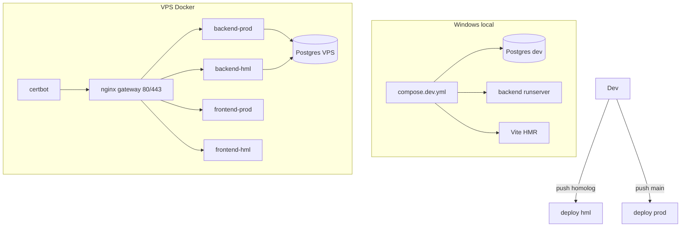

## Arquitetura — UniversidadeMoney

### Objetivo

Monorepo com **execução via Docker** em três ambientes:

| Ambiente | Onde | Domínio / acesso | Banco |
|----------|------|------------------|-------|
| **development** | Windows (Docker Desktop) | `localhost:5173` / `:8080` | `universidade_money_dev` |
| **homologation** | VPS | `universidade-hml.moneypromotora.com.br` | `universidade_money_hml` |
| **production** | VPS | `universidade.moneypromotora.com.br` | `universidade_money` |

A escolha do ambiente é **explícita** (arquivo Compose + `.env`), não por detecção de SO.

### Componentes (Docker)

- **PostgreSQL**: um container; na VPS, dois databases (prod + hml).
- **Django + DRF + Gunicorn**: containers `backend` (dev) / `backend-prod` / `backend-hml`.
- **React + Vite**: HMR no dev; build estático + nginx no prod/hml.
- **nginx gateway**: na VPS, porta 80/443, roteia por `server_name`.
- **certbot**: emissão/renovação Let's Encrypt.

### Topologia



### Contratos de URL

- **API**: `/api/`
- **Admin**: `/admin/`
- **SPA**: `/`
- **Static/Media**: `/static/`, `/media/` (volumes Docker)

### Estrutura do repositório

```
backend/                 # Django + DRF
frontend/                # React + Vite
docker/                  # Dockerfiles, nginx, entrypoint, certbot
compose.yml              # volumes/redes base
compose.dev.yml          # stack local Windows
compose.vps.yml          # stack VPS (prod + hml + gateway)
.env.*.example           # modelos de variáveis
deploy/scripts/          # deploy-docker.sh (+ deploy.sh legado)
.github/workflows/       # deploy main (prod) e homolog (hml)
```

### Comandos rápidos

**Local (Windows):**

```bash
cp .env.development.example .env.development
docker compose -f compose.yml -f compose.dev.yml --env-file .env.development up --build
```

**VPS (produção + homolog):** ver [docs/docker.md](docs/docker.md).

### Deploy

- Push em `main` → GitHub Actions → `deploy-docker.sh prod`
- Push em `homolog` → GitHub Actions → `deploy-docker.sh hml`

### Legado

O stack anterior (venv + systemd + nginx do host, porta gunicorn **7101**) permanece em `deploy/scripts/deploy.sh` e docs `*-vps.md` apenas para rollback durante a migração. O caminho padrão é Docker.
